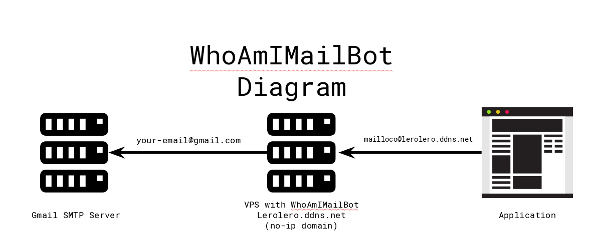

# Who Am I Mail Bot

### What is it?
A service to mask your e-mails, it was inspired by [Blur](https://abine.com/) service, where you create a alias for your e-mail, and use it to signup on applications, but the problem on Blur, is that all e-mails pass trough they infraestructure, and I don't need anybody looking on my e-mails, to solve that, I created WhoAmIMailBot that's similar to Blur service, and runs on your own infraestructure.

### How it works?
Basically you need a domain, to not expend money you can use no-ip services, one VPS that allows smtp outbound, a telegram bot id, your telegram user id and this project, when you have all these things, you're ready to go.
Your VPS will run a postfix that'll just redirect e-mails using the postfix function of virtual alias, where you set a e-mail address to redirect all incoming messages to another e-mail, the no-ip domain will be domain wich you'll use on your alias e-mails, and the telegram bot will manage your alias.



### Install
```bash
git clone https://github.com/mthbernardes/WhoAmIMailBot.git
cd WhoAmIMailBot
docker build -t whoamimailbot --build-arg domain=your-domain-goes-here.ddns.net  .
docker run -p 25:25 -d -v /data/postfix/:/data whoamimailbot -t telegram-bot-api -d your-domain-goes-here.ddns.net -i your-telegram-user-id,another-telegram-user-id
```

### Usage
On your telegram bot you have the follow commands,

| Command		| Description				|
| --------------------- |:-------------------------------------:|
| /list			| List all available aliasi		|
| /new mail@mail.com	| Create a new alias for the given mail |
| /delete bystring	| Delete alias by a given string	|

